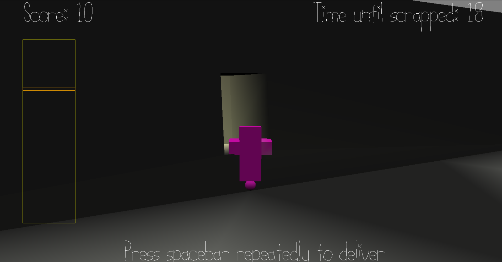

# Scrapped!

Author: Kyle Jannak-Huang

Design: Scrapped! is a resource management game, in which you control a robot collecting solar energy. 
Deliver the electricity awyou produce for points, but if you get too low on battery, you will slow down and eventually be scrapped.
If you don't deliver in a timely manner, however, you will be scrapped by the system and replaced with a new robot.

Screen Shot:

How To Play:

Game summary:

You play as a microrobot in a solar panel, and your job is to collect photons in your bucket. You can turn that energy into battery life for yourself, but you also need to deliver energy to the system.

The top right corner shows how much time you have left to deliver energy before you get Scrapped! and replaced with another microrobot. The yellow bar on the left side of the screen is your battery life, and will turn red once low.

If you are low on battery, you will gradually get slower. If you run out, you get Scrapped!

Controls:

Camera controls:
Click and drag with right-click to rotate the camera. 

Player controls:
Use WASD to move. If you move while holding right-click, you will move in the direction of the camera. Otherwise, you will move in the direction you are already facing.

When near the delivery window, you can press spacebar repeatedly to export your battery life for points, and a timer extension.

Hints:

The lack of shadows may be my lack of a nice shader, but it's also fitting that there's no shadows considering the orbs you are collecting are photons! You will need to make full use of the 3D third-person camera to line yourself up properly with the photons.

Sources: I created all the assets myself using Blender.

This game was built with [NEST](NEST.md).

